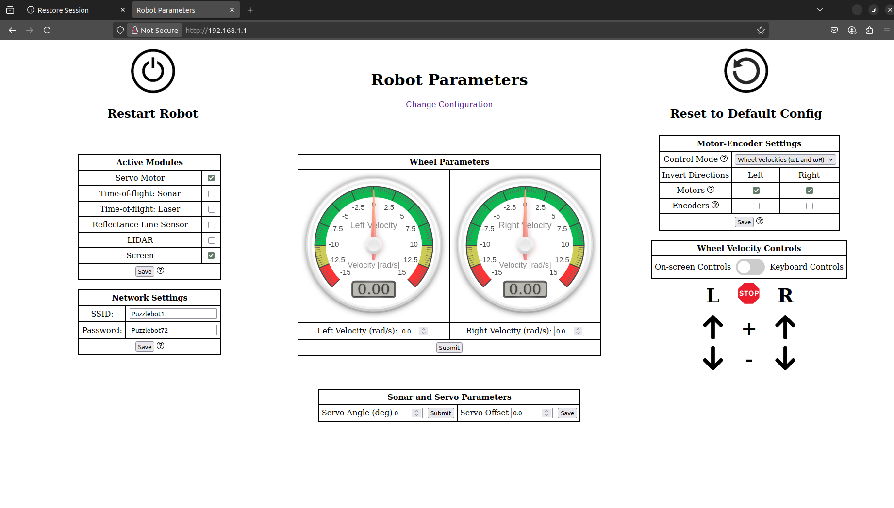
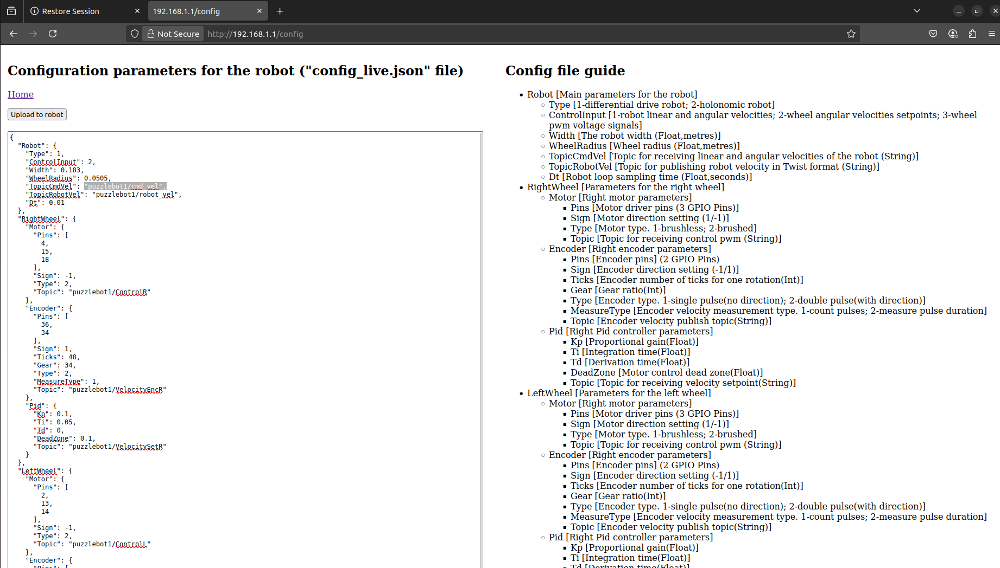
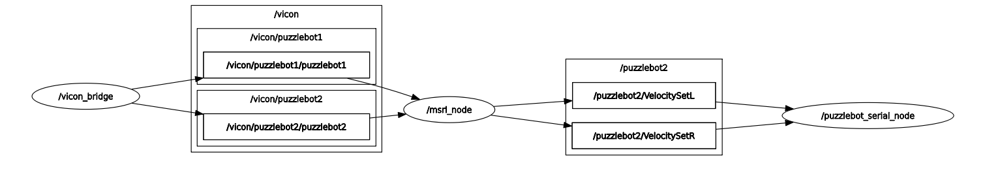

# 1. Pasos para configurar un nuevo Puzzlebot

---

1. Instalar la **imagen OS de Ubuntu 22.04** para el Puzzlebot en la Jetson Nano (Revisar la presentación PPT de **Manchester Robotics Ltd.** para descargar la imagen. Esta guía se encuentra dentro de la carpeta de `configuracion_puzzlebot`).

2. Flashear la imagen OS de Ubuntu 22.04 para el Puzzlebot en la Jetson Nano mediante la herramienta multi-plataforma [Balena Etcher](https://etcher.balena.io/).

2. Conectar y habilitar el funcionamiento de una antena **TP-Link AC1300** para la conexión inalámbrica en un puerto USB de la Jetson Nano del Puzzlebot mediante la instalación de un driver requeridos.

## 1. Conexión de la interfaz TP-Link AC1300

Para instalar los controladores del adaptador inalámbrico `TP-Link T3U Plus AC1300`:

- Conecte el dispositivo y asegúrese de que se detecte mediante ```lsub```.
Para el T3U Plus, el ID es 2357:0138. Consulte las instrucciones de [RTL88x2BU-Linux-Driver](https://github.com/RinCat/RTL88x2BU-Linux-Driver) y ejecute como sudo:

```bash
git clone "https://github.com/RinCat/RTL88x2BU-Linux-Driver.git" /usr/src/rtl88x2bu-git
sed -i 's/PACKAGE_VERSION="@PKGVER@"/PACKAGE_VERSION="git"/g' /usr/src/rtl88x2bu-git/dkms.conf
dkms add -m rtl88x2bu -v git
dkms autoinstall
```

- Reinicie la máquina local en la que realizo los pasos anteriores.

- Consulta también esta discusión del foro [Adaptador WiFi TPLink AC1300](https://forums.developer.nvidia.com/t/wifi-adapter-tplink-ac1300/243480):

- Conecta la Jetson Nano de Puzzlebot a tu PC externa mediante micro-USB para crear una interfaz de red en ambos dispositivos. La IP de la interfaz que se conecta por USB al Nano probablemente sea 192.168.55.x (p. ej., 192.168.55.1). Para determinar la dirección, consulta la página de información de conexión del Jetson Nano.

- Luego, en tu PC externa, comprime el directorio rtl88x2bu en un archivo zip y cópialo al Jetson Nano de la siguiente manera:

```bash
scp rtl88x2bu.zip nombredeusuario@192.168.55.1:/home/nombredeusuario
```

- Reemplaza el nombre de usuario por el nombre de usuario de tu Jetson Nano, como 'puzzlebot'. Al usar la interfaz micro USB, el Jetson siempre tendrá localmente la dirección '192.168.55.1', ​​así que úsala para este paso.

- Después, dentro de la Jetson Nano cambia de directorio a la carpeta y ejecuta los siguientes comandos. El primero tarda un tiempo y mostrará muchas advertencias:

```bash
make
sudo make install
sudo modprobe 88x2bu
sudo reboot
```

- Conecta tu dispositivo TP-Link AC1300 a un puerto USB y conéctate a la conexión Wi-Fi deseada. En este caso, será la red `Lab_Robotica`.

## 2. Auto-arranque de agente de micro-ROS en Jetson Nano

Para iniciar automáticamente el agente Micro-ROS en Boot para la Jetson Nano del Puzzlebot, sigue los siguientes pasos:

### 1. Crea el script de lanzamiento

1. Crea `~/start_micro_ros_agent.sh`:

```bash
#!/bin/bash
source /opt/ros/$ROS_DISTRO/setup.bash
source ~/ros2_ws/install/setup.bash
ros2 launch micro_ros_agent_launch.py
```

2. Házlo ejecutable:

```bash
chmod +x ~/start_micro_ros_agent.sh
```

3. Crea un servicio systemd

Crea `/etc/systemd/system/micro_ros_agent.service`:

```ini
[Unit]
Description=Micro-ROS Agent Service
After=network.target

[Service]
Type=simple
User=username
ExecStart=/home/username/start_micro_ros_agent.sh
Restart=on-failure
RestartSec=5s

[Install]
WantedBy=multi-user.target
```

Reemplaza `username` por el nombre de usuario (e.g., `puzzlebot`).

4. Habilita el servicio

```bash
sudo systemctl daemon-reload
sudo systemctl enable micro_ros_agent.service
sudo systemctl start micro_ros_agent.service
```

5. Verifica

```bash
sudo systemctl status micro_ros_agent.service
ros2 topic list
```

## 3. Renombramiento de tópicos de Puzzlebot

Para que cada Puzzlebot sea distinguido entre sí, es necesario realizar el siguiente paso de renombramiento de sus tópicos. Para hacer esto, se modifican las configuraciones individuales de las Hackerboard de cada Puzzlebot.

1. Primero, se debe conectar a la red Wi-Fi SSID de un Puzzlebot. Selecciona la red e ingresa la contraseña mostrada por el display OLED de la Hackerboard del robot.

2. Ingresa al navegador del dispositivo conectado al Puzzlebot insertando la dirección (http://192.168.1.1).



3. Haz click en "Change Configuration" para ver el archivo de configuración de la Hackerboard.

4. Analiza los tópicos que se usan para las capacidades de ROS2 del Puzzlebot en cuestión.

5. Agrega a los tópicos el siguiente prefijo: (puzzlebot#/). En este caso, el caracter # representa un número único del Puzzlebot. De este modo, los tópicos deben tener el siguiente formato de nombre de ejemplo: (puzzlebot1/cmd_vel, puzzlebot1/robot_vel, puzzlebot1/VelocityEncR, puzzlebot1/VelocityEncL, puzzlebot1/VelocitySetR, puzzlebot1/VelocitySetR).



# 2. Pasos para usar un nuevo Puzzlebot con ROS2 Humble

---

## 1. Pasos para hacer que el Puzzlebot realice un gradiente circular mediante control 

Para este experimento en el que se desea que un nuevo Puzzlebot vaya hacia una condición inicial, complete por un número definido de iteraciones una trayectoria sobre una línea circular de radio definido y se reubique en esta aunque se encuentre fuera o dentro del círculo, sigue los siguientes pasos:

### 1. Adición de nuevo Puzzlebot a VICON

El sistema **VICON** del **Laboratorio de Sistemas Multirobóticos** permite la captura de movimiento de alta precisión. Es un componente clave en el funcionamiento de este experimento, ya que provee estimaciones de la transformada de un marco de coordenadas principal al marco de coordenadas del Puzzlebot.

VICON requiere de un puente para su funcionamiento con ROS2. La instalación del siguiente puente [ros2-vicon-bridge](https://github.com/dasc-lab/ros2-vicon-bridge), inspirado en el [original](https://github.com/ethz-asl/vicon_bridge) es necesario. 

A continuación se provee la solución a un problema encontrado a la hora de realizar los pasos indicados por el manual de instalación con la instalación del paquete `diagnostic_updater` en caso de que te encuentres con lo mismo:

1. Actualiza tu lista de paquetes para tener la información más actualizada sobre los paquetes disponibles

```bash
sudo apt-get update
```

2. Reintenta la instalación

```bash
sudo apt-get install ros-${ROS_DISTRO}-diagnostic-updater
```

Si esto no funciona, realiza el siguiente paso:

3. Realiza la instalación manual del archivo .deb

```bash
wget http://packages.ros.org/ros2/ubuntu/pool/main/r/ros-humble-diagnostic-updater/ros-humble-diagnostic-updater_<version>.deb
sudo dpkg -i ros-humble-diagnostic-updater_<version>.deb
```

4. Limpia tu sistema para prevenir problemas relacionados con la memoria cache

```bash
sudo apt-get clean
sudo apt-get update
sudo apt-get install ros-${ROS_DISTRO}-diagnostic-updater
```

Después de la adición del paquete a un espacio de trabajo de ROS2, reemplaza la dirección IP pre-definida `192.168.1.164` por la de la computadora con el sistema de VICON a los siguientes dos archivos dentro del paquete:

- `all_segments.launch.py` dentro de la carpeta `launch` del paquete `ros2-vicon-bridge`.
- `vicon_bridge.hpp` dentro de la carpeta `include/vicon_bridge` del mismo paquete.

Mantén el puerto de comunicación `801` el mismo.

Con esto hecho, realiza las instrucciones del repositorio del paquete para realizar pruebas de conexión a ROS2 dentro del Laboratorio de Sistemas Multirobóticos, viendo por ejemplo los tópicos disponibles que emite VICON sobre los Puzzlebots con ROS2 en sus Jetson Nano en la red `Lab_Robotica`. Recuerda que los Puzzlebots deben estar conectados esta misma red para que esto funcione.

Para el nuevo Puzzlebot, sigue las siguientes instrucciones para que VICON lo reconozca y te de estimaciones de su pose:

1. Agrega una nueva constelación de marcadores VICON para la captura de movimiento encima de este. Asegúrate de que la nueva constelación de marcadores no sea similar a las de otros Puzzlebots.

2. Después, agrega un marcador temporal encima de la Jetson Nano del Puzzlebot, a 1 centímetro de distancia del origen del marco de coordenadas del robot. Esto es un paso clave para el funcionamiento del Puzzlebot y su localización en el mundo real. 

3. Luego, vuelve a la computadora con el software de VICON abierto para ubicar el centro del marco de coordenadas hacia arriba en el marcador temporal y selecciona todos los demás marcadores para crear el objeto del nuevo Puzzlebot.

4. Agregále un nuevo nombre como: `puzzlebot4` o `puzzlebot12`.

Con esto hecho, tu Puzzlebot ha sido agregado exitosamente en VICON y el programa en MATLAB para el círculo gradiente funcionará.

### 2. Uso de programa CircleGradient en MATLAB

El programa en **MATLAB** `CircleGradient` controla **Puzzlebots** con **ROS2** para que sigan una trayectoria circular definida por un campo vectorial, utilizando:

- **VICON** para tracking y publicación de pose de Puzzlebot 
- **MATLAB** envía velocidades requeridas para Puzzlebot.
- **ROS2 / micro-ROS** para la comunicación y control con los motores.
- 

El flujo general del programa es así:

1. **Inicialización (init.m)**
- Crea un **nodo ROS 2 (/msrl_node)**.
- Configura:
    - Suscriptor VICON (/vicon/puzzlebotX/pose → geometry_msgs/TransformStamped).
    - Publicadores de velocidad (/puzzlebotX/VelocitySetL/R → std_msgs/Float32).
2. **Configuración del Entorno (start_arena.m)**
- Dibuja el campo vectorial que guía al robot hacia un círculo de radio R.
- Mueve los robots a sus posiciones iniciales **(go_to_ic.m)**.
3. **Bucle Principal (MSRL_sim_circle_ros2.m)**
- Obtiene la pose actual **(get_pose.m)** desde VICON.
- Calcula velocidades de ruedas usando:
    - Matriz cinemática inversa (relaciona velocidades del robot con las de las ruedas).
    - Ley de control basada en gradiente (empuja al robot hacia el círculo deseado).
- Envía comandos a los motores **(step.m)** mediante ROS 2.
4. **Parada y Limpieza**
- Detiene los robots **(stop.m)**.
- Cierra el nodo ROS 2.

### 3. Uso conjunto de VICON, MATLAB, ROS2 y micro-ROS

Para el uso del Puzzlebot en este experimento:

1. Coloca el **Puzzlebot** en cualquier sitio dentro de la arena en el **Laboratorio de Sistemas Multirobóticos**.
2. Enciende la fuente de alimentación para el Puzzlebot y asegúrate de tener los **switches activados** para la **Hackerboard** y los **motores**.
3. Espera hasta que el **nodo de micro-ROS** del Puzzlebot sea activado por el servicio ejecutador del launch file responsable de correrlo. Esto puedes confirmarlo con el uso de comandos como `ros2 node list` y `ros2 topic list`.
4. Ve a la computadora con el sistema **VICON** y asegúrate de que el Puzzlebot sea reconocido con su **constelación de marcadores VICON**.
5. Ve a la computadora con **sistema operativo Ubuntu 22.04 y ROS2 Humble Hawksbill** y abre una ventana de terminal.
6. Ejecuta los siguientes comandos: 
```bash 
ros2 run vicon_bridge vicon_bridge
matlab softwareopengl
ros2 topic list
ros2 node list
rqt_graph
```



7. Estos comandos ejecutan el puente de VICON a ROS2, corren el software de MATLAB y muestran los nodos y tópicos disponibles. La información desplegada de permitirá determinar si el flujo del programa está completo.
8. Finalmente, escribe las condiciones iniciales y el número de Puzzlebots que desees utilizar para el experimento y corre el programa `MSRL_sim_circle_ros2`.

El *micro_ros_agent* de cada Puzzlebot es un agente que se encarga de establecer la comunicación y configurar nodos en microcontroladores, no un nodo como tal. El nodo se genera dentro del microcontrolador con el nombre *puzzlebot_serial_node*. Ya que el agente gestiona la comunicación a veces no lo muestra, pero ya que la comunicación se hace por tópicos al agente no importan los nombres de los nodos, solo los nombres de los tópicos.

Para evitar confusiones en la visualización de los flujos de comunicación de cada Puzzlebot con el sistema VICON y el código en MATLAB, estamos trabajando con los desarrolladores de Manchester Robotics Ltd. para que el nombre del nodo *puzzlebot_serial_node* sea una variable cuyo nombre pueda cambiarse y visualizarse con claridad y diferencia en herramientas como rqt_graph.


